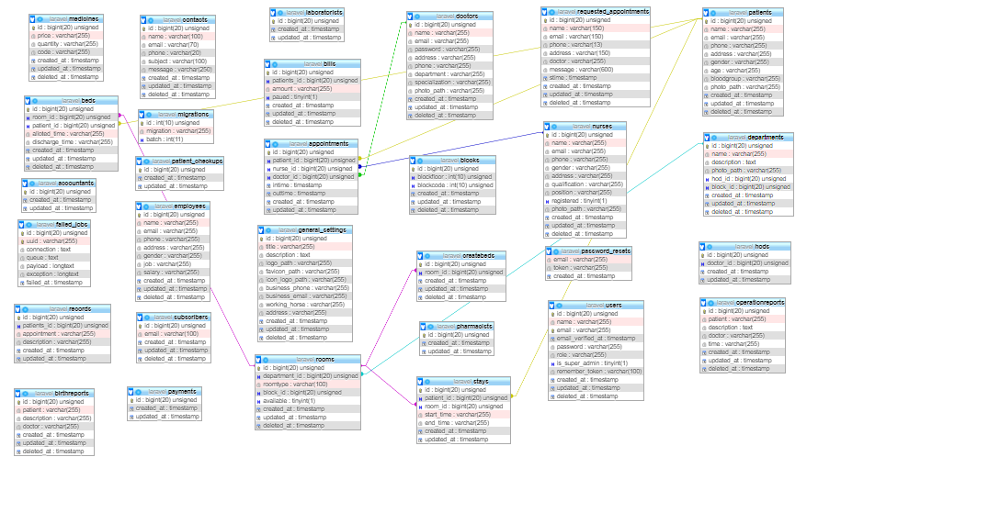

# Haneul Cafe Booking System


## Front End


## Page


<!-- ## Back End


## Database Tables

 -->

## Installation

Follow these instructions to set up and run the project locally on your machine.

### Installation

1. Clone the repository:

```bash
   git clone https://github.com/hunnyNannna/Haneul_Cafe.git
```
 ```bash
   cd Haneul_Cafe
```

 ```bash
composer install
```
 ```bash
cp .env.example .env
```
```bash
php artisan key:generate
 ```
```bash
php artisan storage:link
```
 ```bash
php artisan migrate:fresh --seed
```
 ```bash
php artisan serve
```

<!-- ## Admin Credentials
Admin: 
```bash 
tauseed@test.com
```
Password: 
```bash
tauseed -->
```